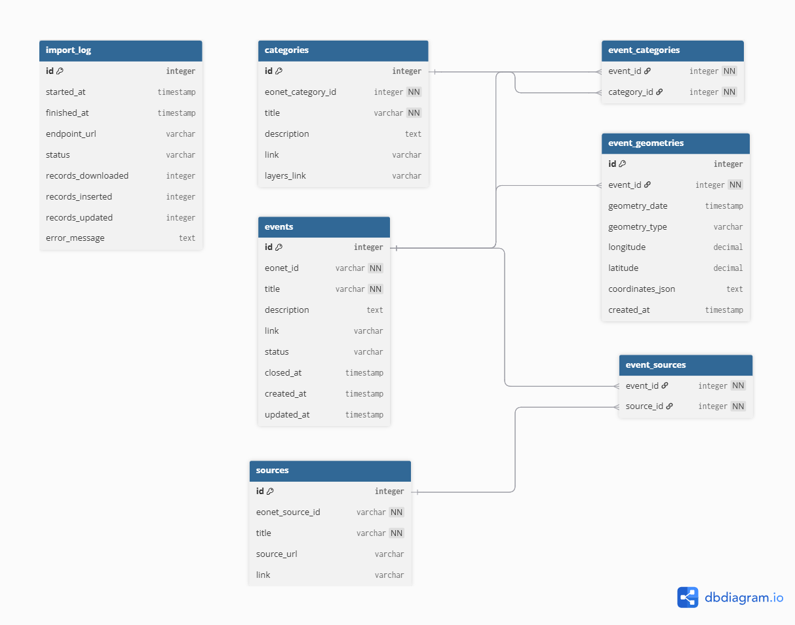

# Projekt semestralny z przedmiotu **Wprowadzenie do Baz Danych**.

Projekt korzysta z API NASA EONET — Earth Observatory Natural Event Tracker — i zapisuje dane o zdarzeniach naturalnych w bazie SQLite.

---

## Funkcje



- pobieranie danych z API EONET,
- zapis zdarzeń do bazy SQLite,
- zapis kategorii, źródeł i geometrii zdarzeń,
- filtrowanie zdarzeń według statusu, dat, kategorii i współrzędnych,
- testy jednostkowe zgodne z `pytest`.

---


## Technologie

- Python
- SQLite
- requests
- python-dotenv
- pytest
- uv

---


## Instalacja

### 1. Instalacja uv

#### Windows PowerShell

```powershell
powershell -ExecutionPolicy ByPass -c "irm https://astral.sh/uv/install.ps1 | iex"
```

#### macOS / Linux

```bash
curl -LsSf https://astral.sh/uv/install.sh | sh
```

---

### 2. Sklonowanie repozytorium

```bash
git clone https://github.com/Bomby888/Projekt_Bazy
cd Projekt_Bazy
```

---

### 3. Utworzenie środowiska i instalacja zależności

```bash
uv venv
uv pip install -r requirements.txt
```

---

### 4. Konfiguracja pliku `.env`

W głównym folderze projektu jest plik `.env`:

```env
EONET_API_URL=https://eonet.gsfc.nasa.gov/api/v3/events
DB_PATH=data/eonet.db
EONET_DAYS=1000
EONET_LIMIT=10000
EONET_STATUS=open
```

Znaczenie pól:

- `EONET_API_URL` – adres API NASA EONET,
- `DB_PATH` – ścieżka do pliku bazy danych SQLite,
- `EONET_DAYS` – liczba ostatnich dni, z których mają zostać pobrane zdarzenia,
- `EONET_LIMIT` – maksymalna liczba pobieranych rekordów,
- `EONET_STATUS` – status zdarzeń: `open` albo `closed`.

Plik `.env` oddziela konfigurację od kodu źródłowego. Dzięki temu można zmienić np. ścieżkę bazy danych lub parametry pobierania bez edytowania pliku `.py`.

---

### 5. Uruchomienie importu danych

```bash
uv run python src/import_eonet.py
```

---

### 6. Sprawdzenie poprawności projektu

```bash
uv run pytest
```

---

### 7. Uruchomienie aplikacji

```bash
uv run python src/main_window.py
```